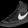

# Lab10

## Checkpoint 1 
  
## Checkpoint 2 
  
## Checkpoint 
- Original Ankle Shoe 
-  
-  Processed Shoe 
  - 
- Original sandle 
-  
- Processed Sandle 
-  
- Original Shirt 
- 
- Processed Shirt
-  
- Results 
-  All 3 correctly identified (the true labeling is screwed up for some reason) 
-  
